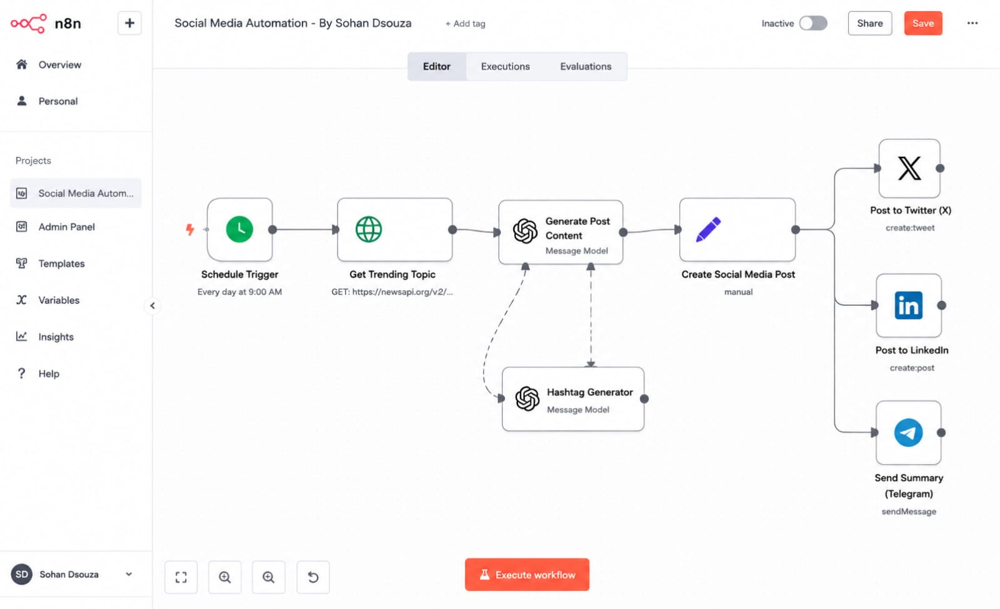
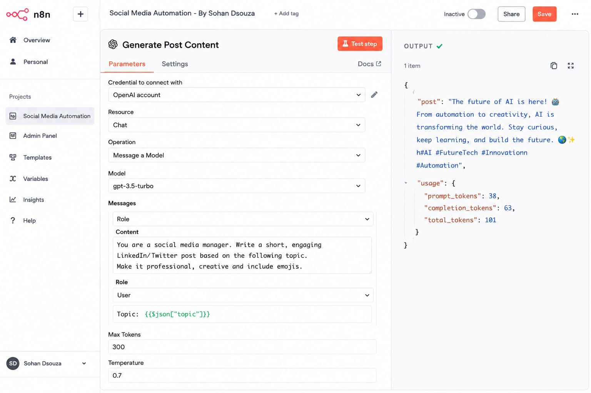
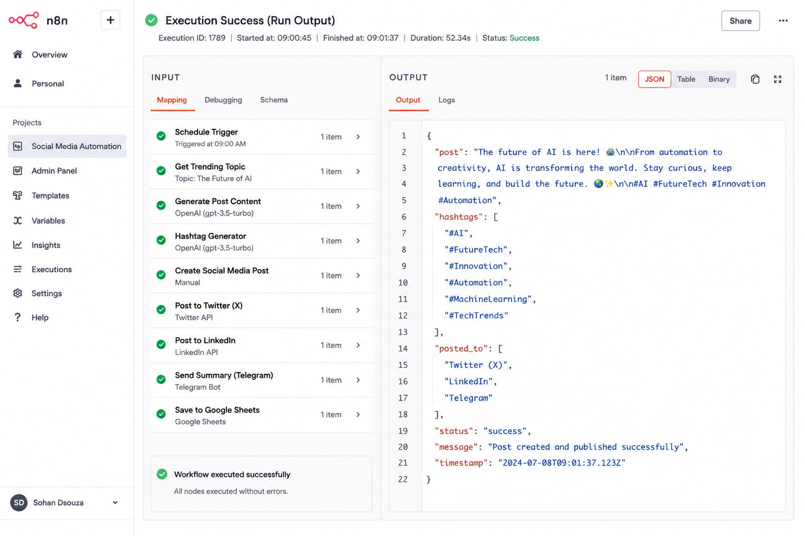
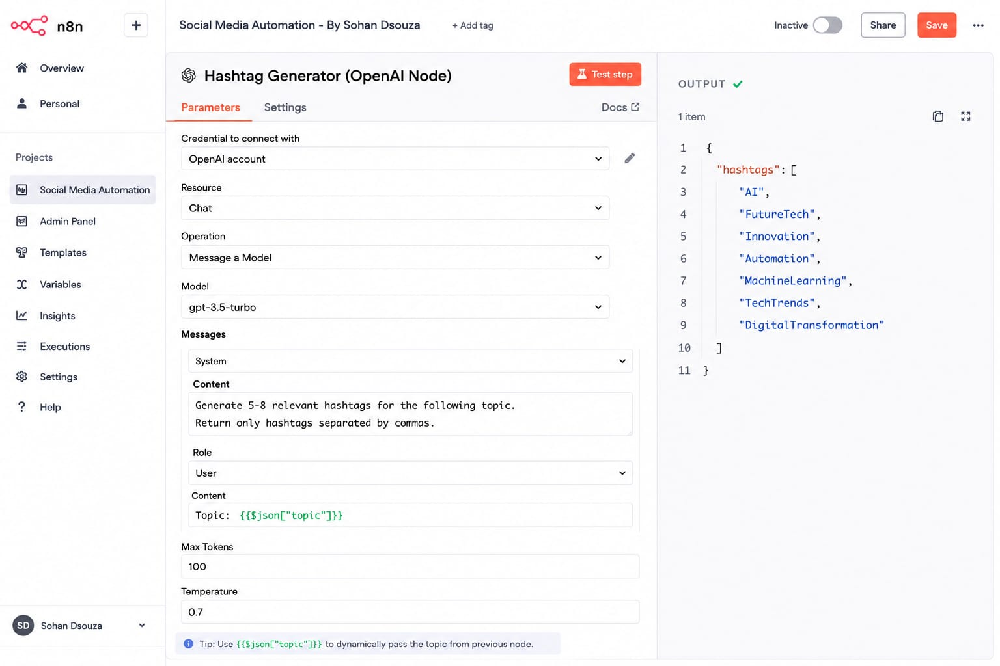
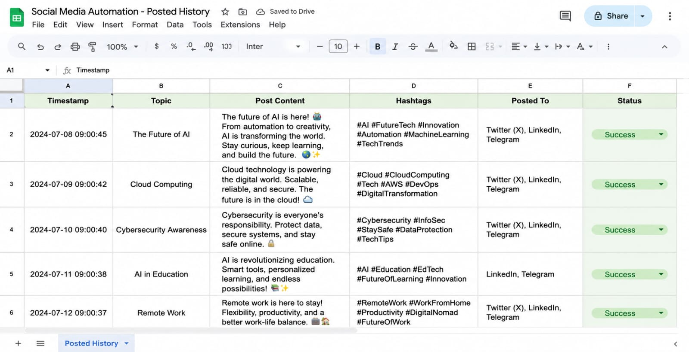

# Social Media Automation using n8n

A workflow automation project built using n8n and AI integrations to automate social media content generation, hashtag creation, and multi-platform posting.

## Features

- Automated trending topic fetching
- AI-generated social media captions
- Automatic hashtag generation
- Multi-platform posting workflow
- Google Sheets post tracking
- Telegram summary notifications

## Tech Stack

- n8n
- OpenAI API
- Node.js
- Google Sheets API
- Telegram API

## Workflow Overview

The workflow automatically:
1. Fetches trending topics
2. Generates AI-based content
3. Creates relevant hashtags
4. Posts content to social platforms
5. Stores posting history in Google Sheets

---

## Screenshots

### Workflow Overview

### AI Content Generation

### Execution Success

### Hashtag Generator

### Google Sheets History

---

## Learning Outcomes

- Workflow automation
- API orchestration
- AI integrations
- Automation pipelines
- Multi-platform scheduling

## Project Status

This project was originally developed using a cloud-hosted n8n environment and later recreated locally for workflow documentation and learning purposes.
